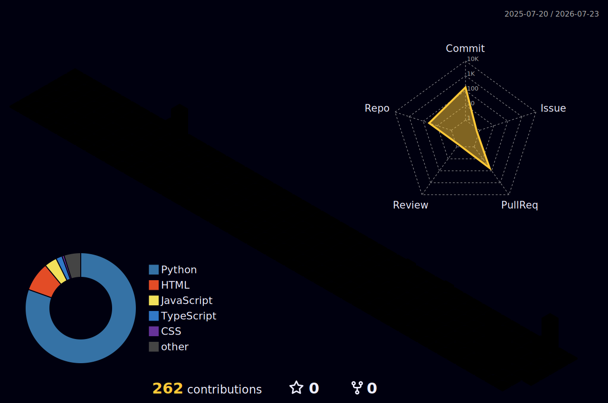

<!-- ===================== HEADER ===================== -->
<h1 align="center">Hi 👋, I'm Ankit Pandey</h1>

<h3 align="center">AI Agent &amp; Full-Stack Developer&nbsp; ·&nbsp; Computer Science Undergraduate</h3>

<p align="center">
  <a href="https://github.com/ankit25bcs10610">
    
  </a>
</p>

<p align="center">
  
  &nbsp;
  
</p>

<!--
  💡 Add your contact badges: paste real URLs below, then uncomment the block.
  <p align="center">
    <a href="https://www.linkedin.com/in/YOUR_LINKEDIN"></a>
    <a href="mailto:YOUR_EMAIL"></a>
    <a href="https://YOUR_PORTFOLIO"></a>
    <a href="https://twitter.com/YOUR_HANDLE"></a>
  </p>
-->

---

<!-- ===================== ABOUT ===================== -->
### 🧑‍💻 About Me

```yaml
name:        Ankit Pandey
role:        AI Agent & Full-Stack Developer
education:   Computer Science Undergraduate
focus:       Autonomous AI agents · Agent orchestration · MCP · Full-stack web
currently:   Building multi-agent systems and shipping web apps
mindset:     "Always learning, always building."
```

- 🤖 I build **autonomous AI agents** that decompose goals, call tools, and deliver results end-to-end.
- 🌐 I ship **full-stack web apps** with **React, TypeScript, and Python**.
- 🧩 Exploring the **Model Context Protocol (MCP)**, agent orchestration, and LLM tooling.
- 🌱 Currently leveling up: advanced agent architectures, system design, and DevOps.
- 💬 Ask me about **AI agents**, **web development**, or anything in my repos.

---

<!-- ===================== TECH STACK ===================== -->
### 🛠️ Tech Stack

<table>
  <tr>
    <td><b>Languages</b></td>
    <td>
      
      
      
      
    </td>
  </tr>
  <tr>
    <td><b>Frontend</b></td>
    <td>
      
      
      
      
    </td>
  </tr>
  <tr>
    <td><b>Backend</b></td>
    <td>
      
      
      
    </td>
  </tr>
  <tr>
    <td><b>AI / ML</b></td>
    <td>
      
      
      
      
      
      
      
    </td>
  </tr>
  <tr>
    <td><b>Tools</b></td>
    <td>
      
      
      
      
    </td>
  </tr>
</table>

---

<!-- ===================== STATS ===================== -->
### 📊 GitHub Analytics

<p align="center">
  
  
</p>

<p align="center">
  
</p>

<p align="center">
  
</p>

---

<!-- ===================== 3D CONTRIBUTION ===================== -->
### 🧊 My Contributions in 3D

<p align="center">
  
</p>

---

<!-- ===================== FOOTER ===================== -->
<p align="center">
  <i>⭐️ Open to collaboration — let's build something great together.</i>
</p>
