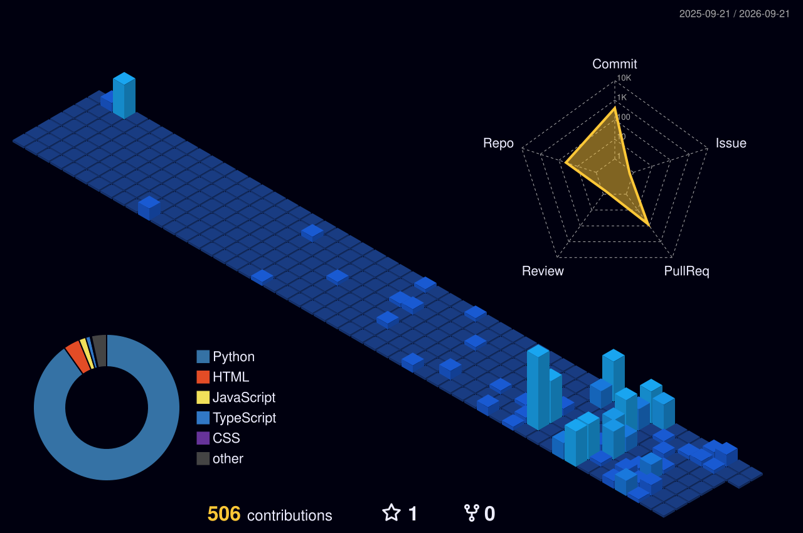
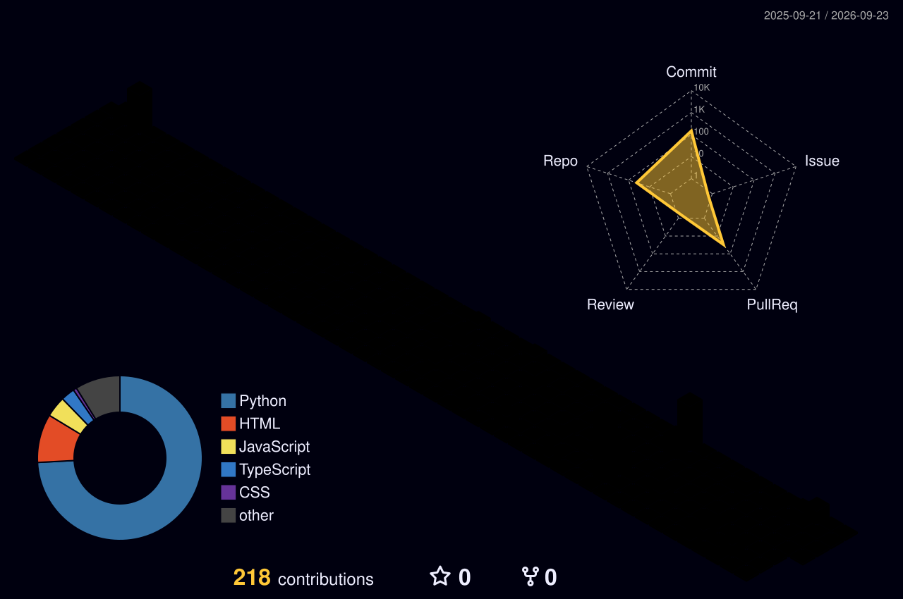
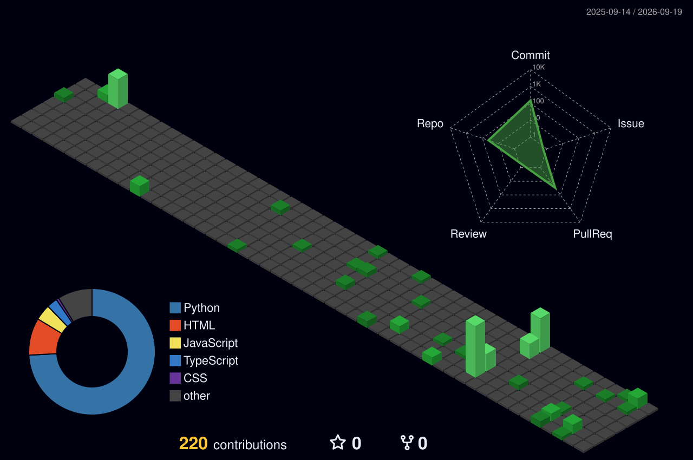
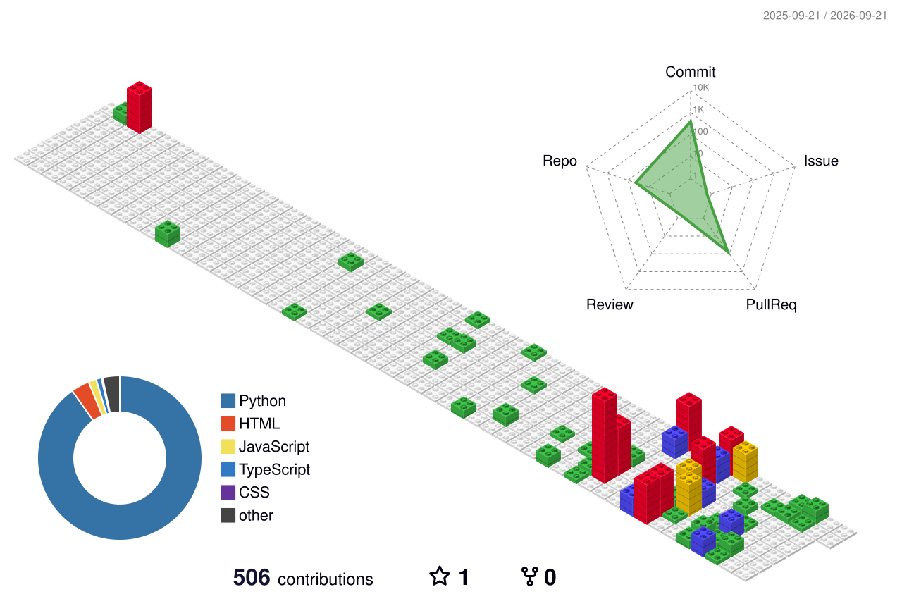
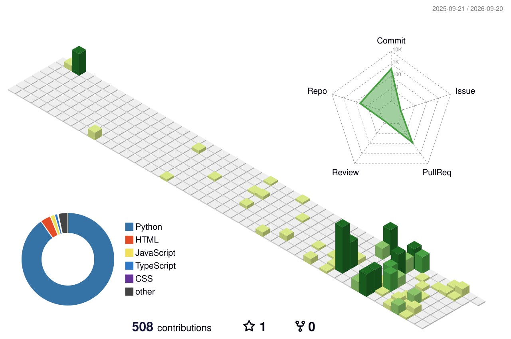
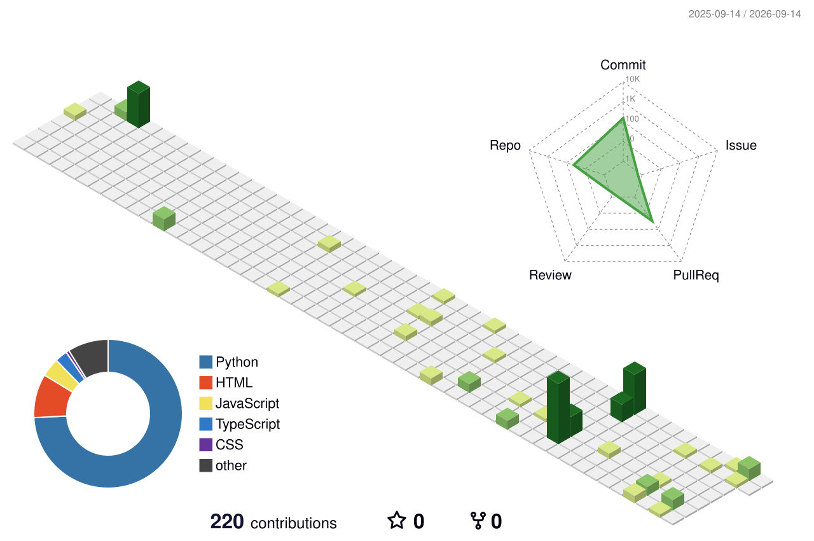
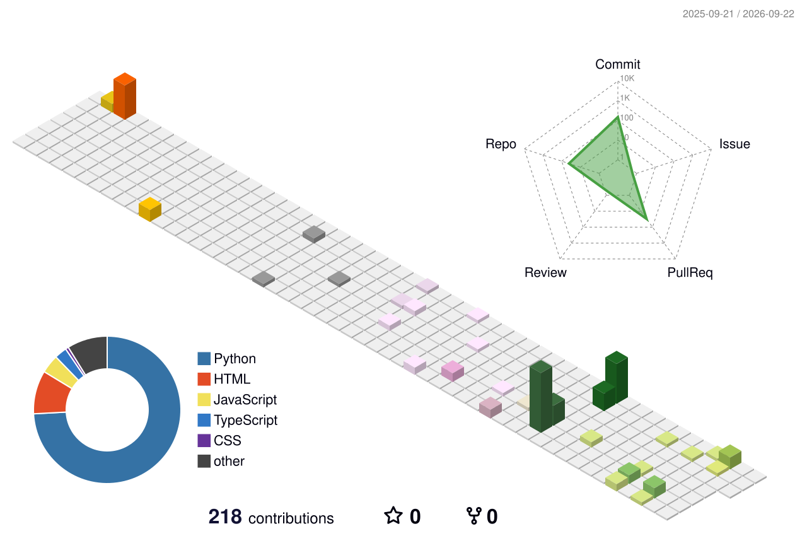
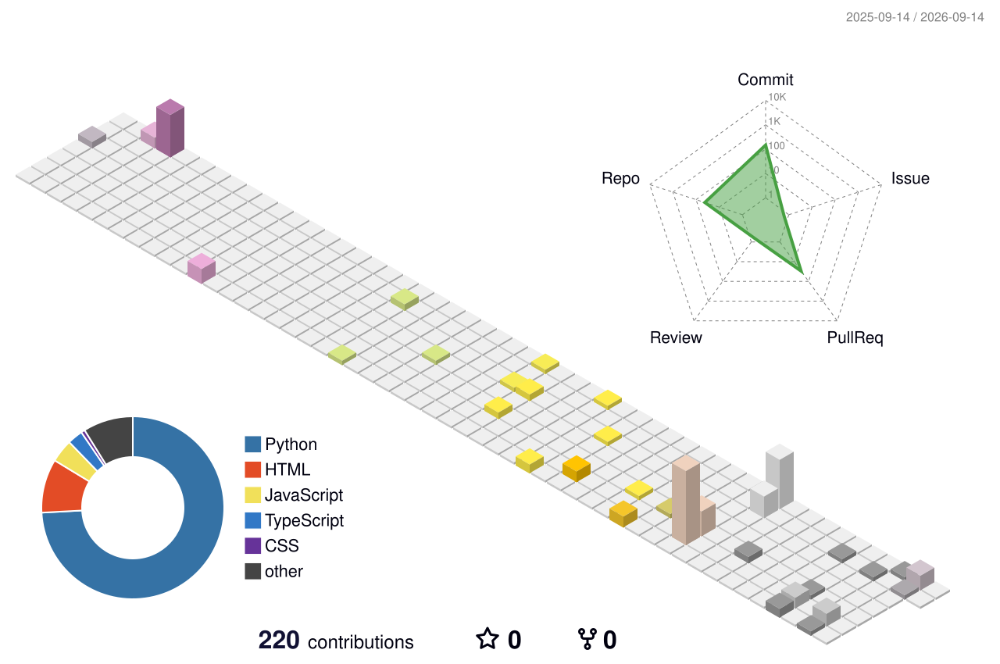
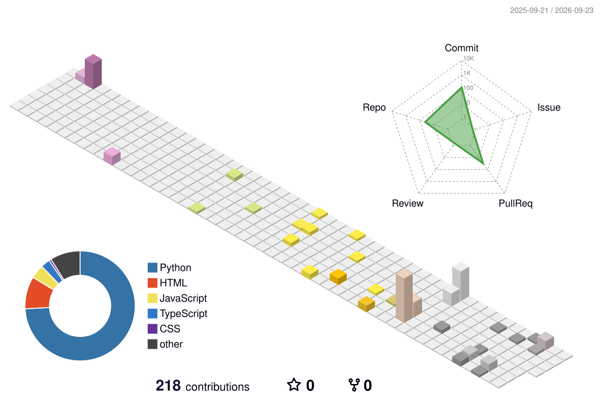

<h1 align="center">
  
</h1>

<h3 align="center">
  
</h3>

<p align="center">
  <a href="https://www.linkedin.com/in/ankit-pandey-5a28b9379/"></a>
  <a href="https://github.com/ankit25bcs10610"></a>
  <a href="https://huggingface.co/pandeyankit84"></a>
  
</p>

---

## About Me

```text
• AI Agent Engineer      → Multi-agent orchestration, tool-calling, and agent safety rails.
• Full-Stack Developer   → Next.js / React / TypeScript on the front, FastAPI & Node on the back.
• Applied ML             → Data-centric model building, evaluation, and reproducible datasets.
• Infra & DevOps         → CI/CD, observability, containerised deploys, incident automation.
• Protocols & Tooling    → Model Context Protocol (MCP) servers, LLM gateways, agent runtimes.
• Open Source            → Publishing datasets, demos, and agent tooling in the open.
• Currently              → Computer Science undergrad, BITS Pilani.
```

> I like building systems that actually run — agents that decompose real goals, call real tools,
> and ship verifiable results. Less demo, more production.

---

## Tech Stack & Tools

<p align="center">
  
</p>

---

## My GitHub Analytics

<div align="center">
  
  
  
  
  
</div>

<p align="center">
  
</p>

---

## My Contributions in 3D

<p align="center">
  
</p>

<p align="center">
  <sub>Every commit I've ever pushed, rendered as a skyline — rebuilt daily by <a href="https://github.com/yoshi389111/github-profile-3d-contrib">github-profile-3d-contrib</a>.</sub>
</p>

<table align="center">
  <tr>
    <td align="center" width="50%"><b>Night Rainbow</b><br/></td>
    <td align="center" width="50%"><b>Night Green</b><br/></td>
  </tr>
  <tr>
    <td align="center"><b>Git Block</b><br/></td>
    <td align="center"><b>Green</b><br/></td>
  </tr>
  <tr>
    <td align="center"><b>Green — animated</b><br/></td>
    <td align="center"><b>Seasons</b><br/></td>
  </tr>
  <tr>
    <td align="center"><b>Seasons — animated</b><br/></td>
    <td align="center"><b>Southern Seasons</b><br/></td>
  </tr>
  <tr>
    <td align="center" colspan="2"><b>Southern Seasons — animated</b><br/></td>
  </tr>
</table>

---

## Achievements

→ **Adaption AutoScientist Challenge — data-centric AI submission:**
- Built two original, self-verifying datasets and models: a function-calling model trained to know when *not* to call a tool, and a bilingual (English/Hindi) multimodal chart-reader.
- Published the datasets on **Hugging Face** and **Kaggle**, with a live demo on **Hugging Face Spaces** and Vercel.

→ **CrewAI Multi-Agent Research System — production-grade agent pipeline:**
- Four cooperating agents (Researcher → Analyst → Writer → Verifier) that turn a plain-language query into a cited, downloadable report, with a real-time dashboard tracking every stage.
- Hardened past MVP scope: job cancellation/retry, JWT revocation, per-report cost tracking, request tracing, Alembic migrations, and CI on every push.

→ **OmniPotent — autonomous infrastructure intelligence platform:**
- Multi-agent incident resolution with deterministic safety controls and deep observability integration, backed by CI and coverage reporting.

→ **Open-source AI tooling:**
- Shipped a remote **Model Context Protocol (MCP)** server, an autonomous triage agent, and experiments with LLM gateway routing across 1,600+ models.

<!-- Add awards, scholarships, hackathon placements or conference selections here as you earn them. -->

---

## Featured Projects

| Project | Description | Repo & Demo Link |
|--------|-------------|-----------|
| Adaption AI Lab → Data-Centric AutoScientist | Two models built around original, self-verifying datasets: a function-calling model that knows when *not* to call a tool, and an English/Hindi multimodal chart-reader. Datasets published to Hugging Face and Kaggle with a live inference demo. | [🔗 Repo](https://github.com/ankit25bcs10610/adaption-ai-lab) · [🔗 Demo](https://autoscientist-toolcaller.vercel.app) |
| CrewAI → Multi-Agent Research System | Four cooperating CrewAI agents (Researcher → Analyst → Writer → Verifier) turn a plain-language query into a cited, downloadable report, with a real-time dashboard to track every stage as it happens. Includes job cancellation/retry, JWT revocation, cost tracking and request tracing. | [🔗 Repo](https://github.com/ankit25bcs10610/CrewAI-Multi-Agent-Research--System) |
| Proxim → AI Conversation Training Lab | Browser-based lab where pharma sales reps rehearse live conversations with AI-simulated healthcare professionals. Streamed dialogue and ElevenLabs speech drive viseme keyframes on a Three.js 3D avatar, keeping voice and lip motion tightly coupled — no native binaries, fully containerised. | 🔒 Private repo |
| omniBox → Autonomous Goal Delegation | Assign any goal to an AI — it decomposes the task, spins up specialised agents, uses your tools, and delivers results. No workflows to define, no steps to configure. Multi-provider (Groq / Anthropic) with Tavily, Slack and GitHub integrations. | [🔗 Repo](https://github.com/ankit25bcs10610/omniBox) |
| Cortex-AI → Intelligent Personal Workspace | Full-stack workspace unifying tasks, habits, goals and learning behind an AI coach. Recurring-task engine, streak tracking, gamified XP/levels, calendar time-blocking and an AI auto-planner, on React + Vite + Zustand with an Express API and Firebase Auth. | [🔗 Repo](https://github.com/ankit25bcs10610/CORTEX-AI) |
| MCP Remote Server | A remote **Model Context Protocol** server implementation — exposes tools and resources over the wire so any MCP-compatible client can discover and call them. | [🔗 Repo](https://github.com/ankit25bcs10610/MCP-REMOTE_SERVER) |
| Triage Agent | Autonomous agent for automated triage: classifies incoming work, routes it, and acts on it without a human in the loop for the routine cases. | [🔗 Repo](https://github.com/ankit25bcs10610/TRIAGE-AGENT) |
| Finance Tracker | Full-stack application to track, categorise and visualise personal finances. | [🔗 Repo](https://github.com/ankit25bcs10610/FINANCE-TRACKER) |
| CodeCrafters Shell (Java) | A POSIX-style shell written from scratch in Java — tokenising, quoting, builtins, redirection and process execution. | [🔗 Repo](https://github.com/ankit25bcs10610/CODECRAFTERS-SHELL-JAVA) |

---

## GitHub Trophies


---

## Terminal Mode

```bash
> whoami
Ankit Pandey | Computer Science @ BITS Pilani

> pwd
~/work/ai-agents

> ls
Agents/
MCP/
Full-Stack/
Applied-ML/
DevOps/

> cat focus.txt
Multi-Agent Orchestration
Model Context Protocol
LLM Tooling & Evaluation
Full-Stack Product Engineering

> cat goals.txt
Ship agents that survive production.
Contribute to Open Source.
Build in public, measure everything.
```
